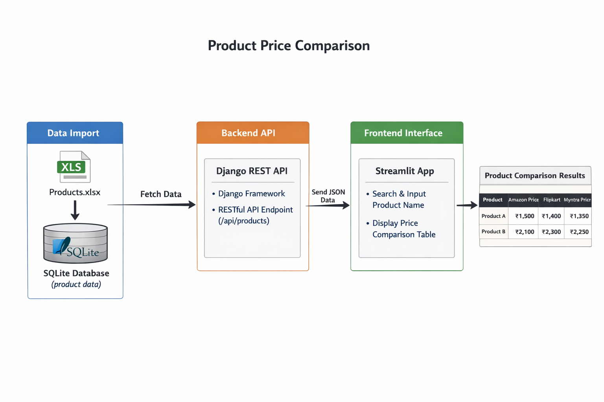
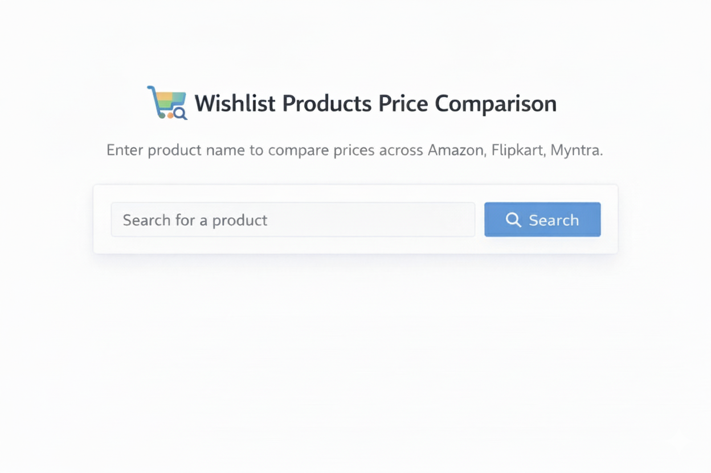

# 🛒 Product Price Comparison Website

## 📌 Project Overview
The **Product Price Comparison Website** allows users to search for products and compare prices across multiple platforms such as **Amazon, Flipkart, and Myntra**.  
The project uses a **Django REST API backend**, a **SQLite database**, and a **Streamlit frontend** to demonstrate frontend–backend integration using Python.

---

## 🎯 Features
- Search products by name  
- Compare prices across multiple platforms  
- Display product name, description, and prices  
- REST API–based architecture  
- Simple and interactive user interface  

---

## 🏗 System Architecture / Flowchart

The following diagram represents the architecture and working flow of the project:



**Flow:**

---

## 🧰 Tools, Libraries & Technologies
- **Programming Language:** Python  
- **Backend:** Django, Django REST Framework  
- **Frontend:** Streamlit  
- **Library:** Requests  
- **Database:** SQLite  

---

## 📊 Output Screenshots

### 🔹 Home / Search Screen


### 🔹 Price Comparison Output


## ⚙ How It Works
1. User enters a product name in the Streamlit interface.
2. Streamlit sends an HTTP GET request to the Django REST API.
3. Django retrieves product data from the SQLite database.
4. The API returns data in JSON format.
5. Streamlit displays the product price comparison results.

---

## ▶ How to Run the Project

### 1️⃣ Start Django Backend
```bash
cd backend
python manage.py runserver

2️⃣ Start Streamlit Frontend
streamlit run product_app.py
